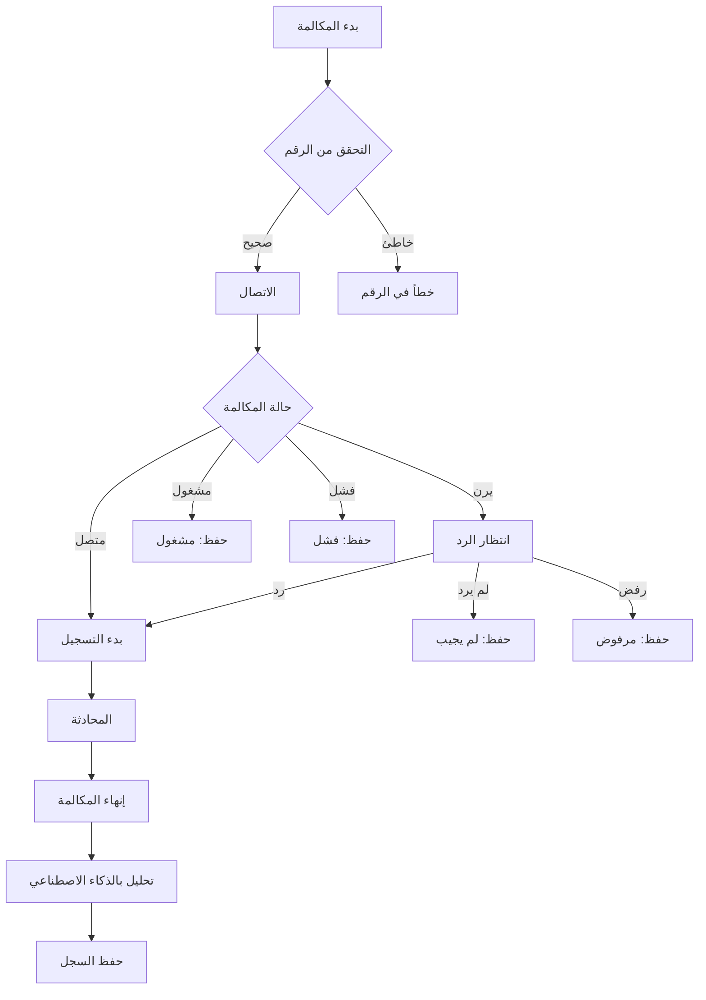

# شُهب - منصة التحصيل الذكي للمتعثرين

<div align="center">
  
  
  ### 🌟 منصة SaaS ذكية للبنوك والمؤسسات المالية
  **تقنية متقدمة مدعومة بالذكاء الاصطناعي لزيادة معدلات الاسترداد**
</div>

---

## 📋 نظرة عامة

**شُهب** هي منصة تحصيل ذكية متطورة تستخدم الذكاء الاصطناعي لمساعدة البنوك والمؤسسات المالية على:

- 🎯 زيادة معدلات الاسترداد بنسبة تصل إلى **67%**
- 💰 تقليل التكاليف التشغيلية بنسبة **50%**
- 🤖 أتمتة عمليات التحصيل بالكامل
- 📊 تحليل سلوك العملاء المتعثرين
- 📞 مكالمات صوتية ذكية بنبرة إنسانية

---

## 🚀 المميزات الرئيسية

### 🧠 تحليل ذكي للعملاء
- تحليل المكالمات الصوتية والبيانات المالية
- تقييم شامل لحالة العميل (القدرة والنية)
- نقاط ذكاء اصطناعي لكل حالة

### 🤖 أتمتة كاملة
- إدارة تلقائية للمهام من الاتصالات إلى التوثيق
- تحديد الأولويات الذكي
- جدولة المتابعة التلقائية

### 💡 حلول سداد مخصصة
- اقتراح خطط دفع مرنة
- تحليل الوضع المالي للعميل
- رسائل مخصصة وودية

### 📈 تحليلات متقدمة
- لوحة تحكم لحظية
- تقارير أداء فورية
- مؤشرات KPI ذكية

---

## 🛠️ التقنيات المستخدمة

- **Frontend**: HTML5, CSS3, JavaScript (ES6+)
- **Backend**: Node.js, Express.js
- **Charts**: Chart.js
- **UI/UX**: Custom CSS Grid & Flexbox
- **Icons**: Font Awesome
- **Fonts**: Tajawal (Arabic Typography)
- **Data Generation**: Custom Faker-like implementation

---

## 🚀 كيفية التشغيل

### المتطلبات الأساسية
- Node.js (v14 أو أحدث)
- npm أو yarn
- حساب Twilio (للمكالمات الحقيقية)

### خطوات التثبيت

1. **استنساخ المشروع**
   ```bash
   git clone <repository-url>
   cd shuhub-finance
   ```

2. **تثبيت المكتبات**
   ```bash
   npm install
   ```

3. **إعداد Twilio (للمكالمات الحقيقية)**
   
   أ. سجل في [Twilio Console](https://console.twilio.com)
   
   ب. احصل على:
   - Account SID: `AC1669d035f7311675a89169807c02d287`
   - Auth Token: `b5d208367a830b148cf4aef8b87ac025`
   - رقم هاتف Twilio (مثل: `+13185234059`)
   
   ج. أنشئ TwiML Application في Twilio Console
   
   د. حدث بيانات الاعتماد في `server.js`

4. **تشغيل الخادم**
   ```bash
   npm start
   ```
   
   أو للتطوير:
   ```bash
   npm run dev
   ```

5. **فتح المتصفح**
   ```
   http://localhost:3000
   ```

### 📞 إعداد المكالمات

#### للمكالمات التجريبية (افتراضي):
- النظام سيعمل في وضع fallback
- ستظهر حالات مختلفة للمكالمات
- لن يتم إجراء مكالمات حقيقية

#### للمكالمات الحقيقية:
1. تأكد من إعداد Twilio صحيح
2. استخدم أرقام مُتحقق منها في Twilio
3. النظام سيكتشف إعداد Twilio تلقائياً

---

## 📁 هيكل المشروع

```
shuhub-finance/
├── public/
│   ├── css/
│   │   ├── style.css          # الأنماط الرئيسية
│   │   └── dashboard.css      # أنماط لوحة التحكم
│   ├── js/
│   │   ├── main.js           # الوظائف الرئيسية
│   │   └── dashboard.js      # وظائف لوحة التحكم
│   ├── index.html            # الصفحة الرئيسية
│   ├── dashboard.html        # لوحة التحكم
│   └── analytics.html        # صفحة التحليلات
├── server.js                 # خادم Express
├── package.json             # إعدادات المشروع
└── README.md               # هذا الملف
```

---

## 🎨 الصفحات والميزات

### 🏠 الصفحة الرئيسية (`/`)
- عرض المميزات والحلول
- إحصائيات المنصة
- خطط الأسعار
- معلومات الشركة

### 📊 لوحة التحكم (`/dashboard`)
- مقاييس الأداء الرئيسية
- رسوم بيانية تفاعلية
- قائمة المتعثرين
- الأنشطة الأخيرة
- إدارة الحالات

### 📈 التحليلات (`/analytics`)
- تحليلات متقدمة
- تقارير مفصلة
- رسوم بيانية معقدة
- تصدير البيانات

---

## 📊 البيانات التجريبية

المنصة تأتي مع بيانات تجريبية واقعية تشمل:

- **2,847** متعثر وهمي
- **127** بنك ومؤسسة مالية
- **15,432** مكالمة آلية
- **48.7M SAR** مبالغ مستردة
- تقارير وإحصائيات شاملة

جميع البيانات مولدة باستخدام خوارزميات ذكية لمحاكاة السيناريوهات الحقيقية.

---

## 📞 نظام المكالمات المتطور

### 🎯 حالات المكالمات المدعومة

النظام يتعامل مع جميع حالات المكالمات الواقعية:

| الحالة | الوصف | الإجراء |
|--------|-------|---------|
| **متصل** | تم الاتصال بنجاح | تسجيل وتحليل المحادثة |
| **لم يجيب** | العميل لم يرد | حفظ محاولة + توصيات |
| **مشغول** | الخط مشغول | جدولة إعادة محاولة |
| **فشل الاتصال** | خطأ في الشبكة | تشخيص المشكلة |
| **مرفوض** | رفض المكالمة | تحليل سلوك العميل |
| **انتهت المهلة** | لم يرد خلال 30 ثانية | تسجيل عدم استجابة |

### 🔄 تدفق المكالمة



### 🤖 التحليل الذكي

- **تحويل صوت لنص**: Whisper API
- **تحليل المشاعر**: GPT-4o
- **تقييم التعاون**: خوارزميات مخصصة
- **التوصيات**: نصائح للمتابعة

## 🎯 المنافسون والإلهام

تم تصميم المنصة مع الاستلهام من أفضل الممارسات في:

1. **Prodigal Technologies** - تحليل المحادثات والامتثال
2. **TrueAccord** - النهج الإنساني في التواصل
3. **Vodex.ai** - الوكلاء الصوتيون الآليون
4. **HighRadius** - منصات SaaS للمؤسسات
5. **Kolleno/Gaviti** - التنبؤات الذكية والتحليلات

---

## 🌟 الميزات التقنية

### 🎨 التصميم
- **Responsive Design** - يعمل على جميع الأجهزة
- **Arabic RTL Support** - دعم كامل للغة العربية
- **Modern UI/UX** - تصميم عصري وسهل الاستخدام
- **Dark Mode Ready** - جاهز للوضع المظلم

### ⚡ الأداء
- **Lazy Loading** - تحميل تدريجي للمحتوى
- **Optimized Charts** - رسوم بيانية محسنة
- **Fast Animations** - حركات سريعة ومتطورة
- **Mobile Optimized** - محسن للهواتف المحمولة

### 🔒 الأمان
- **Data Validation** - التحقق من البيانات
- **Secure APIs** - واجهات برمجة آمنة
- **Input Sanitization** - تنظيف المدخلات
- **HTTPS Ready** - جاهز للنشر الآمن

---

## 📈 الإحصائيات والمقاييس

### 🎯 مقاييس الأداء
- معدل الاسترداد: **67.3%**
- نمو شهري: **+24.7%**
- متوسط وقت الاسترداد: **8.4 أيام**
- رضا العملاء: **94%**

### 💰 التأثير المالي
- توفير في التكاليف: **50%**
- زيادة الإيرادات: **35%**
- تقليل الوقت: **60%**
- تحسين الكفاءة: **80%**

---

## 🚀 خطط التطوير المستقبلية

### المرحلة الأولى ✅
- [x] الصفحة الرئيسية
- [x] لوحة التحكم الأساسية
- [x] الرسوم البيانية التفاعلية
- [x] البيانات التجريبية

### المرحلة الثانية 🔄
- [ ] تكامل API حقيقي
- [ ] نظام المصادقة
- [ ] إدارة المستخدمين
- [ ] تصدير التقارير

### المرحلة الثالثة 📅
- [ ] تطبيق الجوال
- [ ] ذكاء اصطناعي متقدم
- [ ] تكامل مع البنوك
- [ ] تحليلات تنبؤية

---

## 🤝 المساهمة

نرحب بالمساهمات! يرجى اتباع الخطوات التالية:

1. Fork المشروع
2. إنشاء فرع جديد (`git checkout -b feature/AmazingFeature`)
3. Commit التغييرات (`git commit -m 'Add some AmazingFeature'`)
4. Push للفرع (`git push origin feature/AmazingFeature`)
5. فتح Pull Request

---

## 📞 التواصل والدعم

- **الموقع الرسمي**: [شُهب المالية](https://shuhub-finance.com)
- **البريد الإلكتروني**: support@shuhub-finance.com
- **الهاتف**: +966 11 123 4567
- **LinkedIn**: [شُهب الشركة](https://linkedin.com/company/shuhub)

---

## 📄 الترخيص

هذا المشروع مرخص تحت رخصة MIT - انظر ملف [LICENSE](LICENSE) للتفاصيل.

---

## 🙏 شكر وتقدير

- شكر خاص لفريق التطوير المتميز
- تقدير للمؤسسات المالية التي ساهمت في التطوير
- شكر للمجتمع التقني العربي

---

<div align="center">
  <h3>🌟 صنع بـ ❤️ في المملكة العربية السعودية</h3>
  <p>© 2024 شُهب - جميع الحقوق محفوظة</p>
</div>